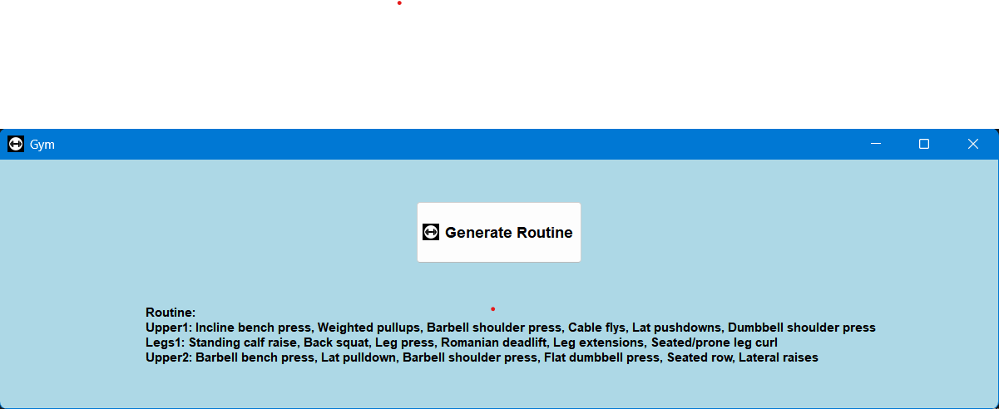

# Gym-Generator 🏋️

A desktop application that generates randomized gym workout routines following an Upper/Lower split training program. Perfect for adding variety to your strength training and preventing workout plateaus.


## 📋 Overview

Gym-Generator creates customized workout plans by randomly selecting exercises from scientifically backed exercise categories. The app generates three distinct training days:

- **Upper 1**: Chest, back, and shoulder exercises (6 exercises)
- **Legs 1**: Complete lower body routine (6 exercises)
- **Upper 2**: Alternative upper body exercises to ensure variety (6 exercises)

Each workout is designed to target major muscle groups with a mix of compound and isolation movements.

## ✨ Features

- **Randomized Exercise Selection**: Never do the same exact workout twice
- **Upper/Lower Split Program**: Efficient training structure for strength and hypertrophy
- **Balanced Programming**: Ensures coverage of all major muscle groups
- **Simple GUI**: Clean, user-friendly PyQt5 interface
- **One-Click Generation**: Generate a new weekly routine instantly
- **Exercise Variety**: Includes both primary compound movements and accessory exercises

## 🚀 Installation

### Prerequisites
- Python 3.9+ (tested on Python 3.9)
- Windows OS (PyQt5 configured for Windows)

### Setup

1. Clone the repository:
```bash
git clone https://github.com/deep-kapadia-6/Gym-Generator.git
cd Gym-Generator
```

2. Install required dependencies:
```bash
pip install -r requirements.txt
```

Dependencies include:
1. numpy - For random exercise selection
2. PyQt5 - For the GUI application

## 💻 Usage

### Running the Desktop App

```bash
python app.py
```

This launches the PyQt5 GUI window, where you can:
1. Click the "Generate Routine" button
2. View your randomized 3-day workout split
3. Generate new routines as needed

### Using the Jupyter Notebook

Alternatively, explore the exercise randomization logic interactively:
```bash
jupyter notebook gym_shuffle.ipynb
```
The notebook contains the same exercise selection algorithm and can be used for testing or customization.

## 📂 Project Structure

Gym-Generator/
├── app.py                 # Main PyQt5 desktop application
├── gym_shuffle.ipynb      # Interactive Jupyter notebook version
├── requirements.txt       # Python dependencies
├── static/
│   └── dumbbell.ico      # Application icon
├── LICENSE               # MIT License
└── README.md            # This file

## 🎯 Exercise Categories

The app includes exercises organized by muscle groups:

Upper Body:
Chest Primary: Barbell bench press, Incline bench press
Chest Secondary: Flat/Incline dumbbell press, Cable flys, Pushups
Back Primary: Lat pulldown, Weighted pullups
Back Secondary: Seated/Bent over rows, Lat pushdowns, Face pulls
Shoulder Primary: Barbell shoulder press
Shoulder Secondary: Dumbbell shoulder press, Lateral raises, Cable crossover

Lower Body:
Quads Primary: Back squat, Front squat
Quads Secondary: Leg press, Split squats, Lunges
Glutes: Hip thrusts, Deadlift, Romanian deadlift, Glute ham raise, Sled push
Hamstrings: Seated/Prone leg curl
Calves: Standing/Seated calf raise, Leg press calf raise
Quad Finisher: Leg extensions

## 🎨 Customization

To modify the exercise pool, edit the exercise lists in either:

app.py (lines 41-55) in the week() method

gym_shuffle.ipynb (cell 2) in the week() function

Example:
```python
self.chest1 = ['Barbell bench press', 'Incline bench press', 'Your custom exercise']
```

## 🛠️ Technical Details

Framework: PyQt5 for cross-platform GUI
Randomization: NumPy's random choice for exercise selection
Architecture: Simple object-oriented design with clear separation of UI and logic
Window Size: 1200x300 pixels (optimized for routine display)

## 📝 Example Output


```text
Upper1: Incline bench press, Weighted pullups, Barbell shoulder press, 
        Cable flys, Face pulls, Lateral raises

Legs1: Standing calf raise, Front squat, Lunges, Deadlift, 
       Leg extensions, Seated/prone leg curl

Upper2: Barbell bench press, Lat pulldown, Barbell shoulder press, 
        Flat dumbbell press, Bent over row, Single arm leaning in raise
```

## 🤝 Contributing

Contributions are welcome! Feel free to:
1. Add new exercises to the database
2. Improve the UI/UX
3. Add features like workout logging or progress tracking
4. Fix bugs or improve documentation
5. Please open an issue or submit a pull request.

## 📄 License

This project is licensed under the MIT License - see the LICENSE file for details.

## 🙏 Acknowledgments

Exercise selection based on evidence-based resistance training principles

Built for personal use and shared with the fitness community

## 📧 Contact

Created by @deep-kapadia-6

Note: Always consult with a fitness professional before starting any new workout program. This app is for educational and organizational purposes.
